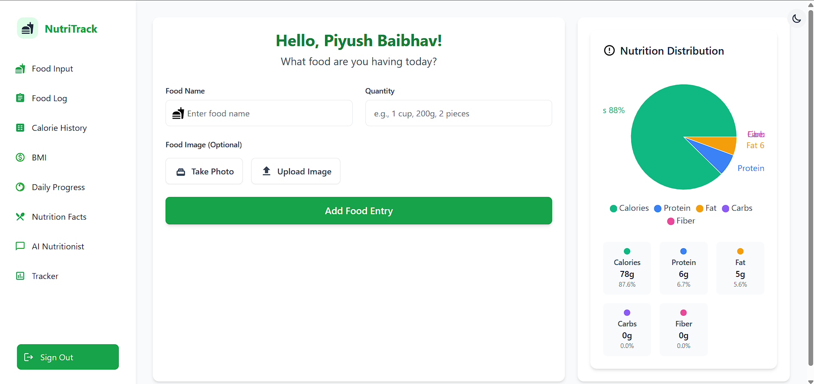

# 🍽️ Food Calorie Tracker

An intelligent food tracking application that uses AI to help users maintain a healthy lifestyle. Built with React, Flask, TensorFlow, and Firebase.



## ✨ Core Features

### 🧠 AI-Powered Features
- **Image Classification**: Upload food photos to automatically identify meals using TensorFlow.js
- **AI Nutritionist**: Get personalized meal recommendations and nutritional advice
- **Smart Meal Analysis**: AI-powered analysis of your food choices and patterns
- **Food Fact Finder**: Discover interesting facts and nutritional information about your meals

### 📊 Tracking & Analytics
- **Comprehensive Meal Logs**: Track breakfast, lunch, dinner, and snacks
- **Nutritional Breakdown**: Detailed analysis of calories, macros, and micros
- **Progress Tracking**: Monitor your health journey with multiple metrics
- **BMI Calculator**: Track your Body Mass Index over time
- **Customizable Goals**: Set and track personalized health goals

### 📈 Advanced Data Visualization
- **Nutrition Charts**: Visualize your daily, weekly, and monthly nutrition intake
- **Progress Graphs**: Track your health metrics over time
- **Meal Pattern Analysis**: Identify your eating habits and patterns
- **Goal Achievement Charts**: Monitor your progress towards health goals

### 🎮 Gamification
- **Achievement System**: Earn badges for healthy habits
- **Daily Challenges**: Complete health-related challenges
- **Progress Streaks**: Maintain healthy eating streaks
- **Reward System**: Earn points for logging meals and achieving goals

### 🔧 Technical Features
- **Flask Backend**: Robust Python server for image processing and AI
- **TensorFlow Integration**: Advanced image classification models
- **Firebase Integration**: Real-time data sync and authentication
- **Responsive Design**: Works seamlessly across all devices
- **Dark Mode**: Eye-friendly dark theme support

## 🚀 Getting Started

### Prerequisites

- Node.js (v14 or higher)
- Python 3.8 or higher
- npm or yarn
- Firebase account

### Installation

1. Clone the repository:
```bash
git clone https://github.com/piyushbaibhav/food-calorie.git
cd food-calorie
```

2. Install frontend dependencies:
```bash
npm install
```

3. Install backend dependencies:
```bash
cd Backend
pip install -r requirements.txt
```

4. Set up environment variables:
```env
# Frontend (.env)
REACT_APP_FIREBASE_API_KEY=your_api_key
REACT_APP_FIREBASE_AUTH_DOMAIN=your_auth_domain
REACT_APP_FIREBASE_PROJECT_ID=your_project_id
REACT_APP_FIREBASE_STORAGE_BUCKET=your_storage_bucket
REACT_APP_FIREBASE_MESSAGING_SENDER_ID=your_messaging_sender_id
REACT_APP_FIREBASE_APP_ID=your_app_id
REACT_APP_FIREBASE_MEASUREMENT_ID=your_measurement_id

# Backend (.env)
FLASK_APP=app.py
FLASK_ENV=development
FLASK_DEBUG=1
```

5. Start the development servers:
```bash
# Terminal 1 - Frontend
npm start

# Terminal 2 - Backend
cd Backend
flask run
```

## 🛠️ Tech Stack

### Frontend
- **React**: Modern UI framework
- **Tailwind CSS**: Utility-first CSS framework
- **Recharts**: Beautiful data visualization
- **TensorFlow.js**: Client-side image processing
- **Firebase**: Authentication and real-time database

### Backend
- **Flask**: Python web framework
- **TensorFlow**: Advanced image classification
- **OpenCV**: Image processing
- **SQLAlchemy**: Database ORM
- **Google Cloud Vision**: Additional image analysis

### AI/ML
- **Image Classification**: Custom-trained food recognition model
- **Nutritional Analysis**: AI-powered meal analysis
- **Recommendation Engine**: Personalized meal suggestions
- **Pattern Recognition**: Eating habit analysis

## 📊 Data Structure

### Firestore Collections
- **users**: User profiles and preferences
- **meals**: Detailed meal logs with nutritional info
- **progress**: Health metrics and progress tracking
- **achievements**: Gamification data
- **ai_recommendations**: AI-generated suggestions

### Flask Database
- **food_classification**: Image classification results
- **nutritional_data**: Comprehensive food database
- **user_patterns**: AI analysis of user behavior

## 🎮 Gamification System

### Achievements
- **Consistency Badges**: For regular meal logging
- **Health Milestones**: For reaching health goals
- **Challenge Completion**: For completing daily challenges
- **Streak Rewards**: For maintaining healthy habits

### Challenges
- **Daily Goals**: Complete specific health tasks
- **Weekly Challenges**: Longer-term health objectives
- **Community Challenges**: Compete with other users
- **Custom Challenges**: Create your own health goals

## 🤖 AI Features

### Image Classification
- **Food Recognition**: Identify meals from photos
- **Portion Estimation**: Estimate serving sizes
- **Ingredient Detection**: Identify components of meals
- **Nutritional Analysis**: Calculate nutritional content

### AI Nutritionist
- **Personalized Recommendations**: Based on your goals
- **Meal Planning**: Suggest balanced meals
- **Health Insights**: Provide nutritional advice
- **Progress Analysis**: Track and analyze your journey

## 📈 Analytics & Reporting

### Health Metrics
- **BMI Tracking**: Monitor body mass index
- **Calorie Analysis**: Track daily intake
- **Macro Tracking**: Monitor protein, carbs, and fats
- **Micro Tracking**: Track vitamins and minerals

### Progress Visualization
- **Trend Analysis**: Identify patterns in your diet
- **Goal Tracking**: Monitor progress towards objectives
- **Health Reports**: Generate detailed health summaries
- **Export Options**: Download your health data

## 🤝 Contributing

1. Fork the repository
2. Create your feature branch (`git checkout -b feature/AmazingFeature`)
3. Commit your changes (`git commit -m 'Add some AmazingFeature'`)
4. Push to the branch (`git push origin feature/AmazingFeature`)
5. Open a Pull Request

## 📝 License

This project is licensed under the MIT License - see the [LICENSE](LICENSE) file for details.

## 🙏 Acknowledgments

- TensorFlow team for the amazing ML framework
- Flask team for the robust web framework
- Firebase for backend services
- React team for the frontend framework
- Recharts for beautiful data visualization

## 📞 Support

For support, email support@foodcalorie.com or join our Slack channel.

## 🔍 Project Status

[](https://github.com/piyushbaibhav/food-calorie/actions)
[](https://github.com/piyushbaibhav/food-calorie)
[](https://github.com/piyushbaibhav/food-calorie/blob/main/LICENSE)
[](https://github.com/piyushbaibhav/food-calorie/pulls)

---

Made with ❤️ by [Piyush](https://github.com/piyushbaibhav)
